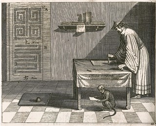
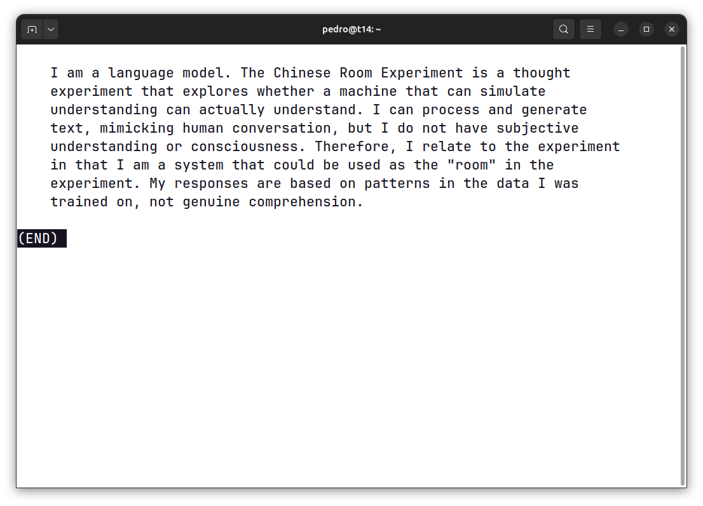

# Chinese Room

<div align="center">
  
</div>

## Ergonomics
Add this to your `.bashrc`. 

```bash
function cr() {
    source /path/to/ChineseRoom/.venv/bin/activate
    clear
    { echo; python /path/to/ChineseRoom/main.py "$@" \
        | fold -s -w 70 \
        | sed 's/^/    /'; } | less
    deactivate
}
```
Then, to submit a very interesting question: 

```bash
cr "In what way do you relate with the chinese room experiment?".
```

And then you may ponder.

<div align="center">
  
</div>